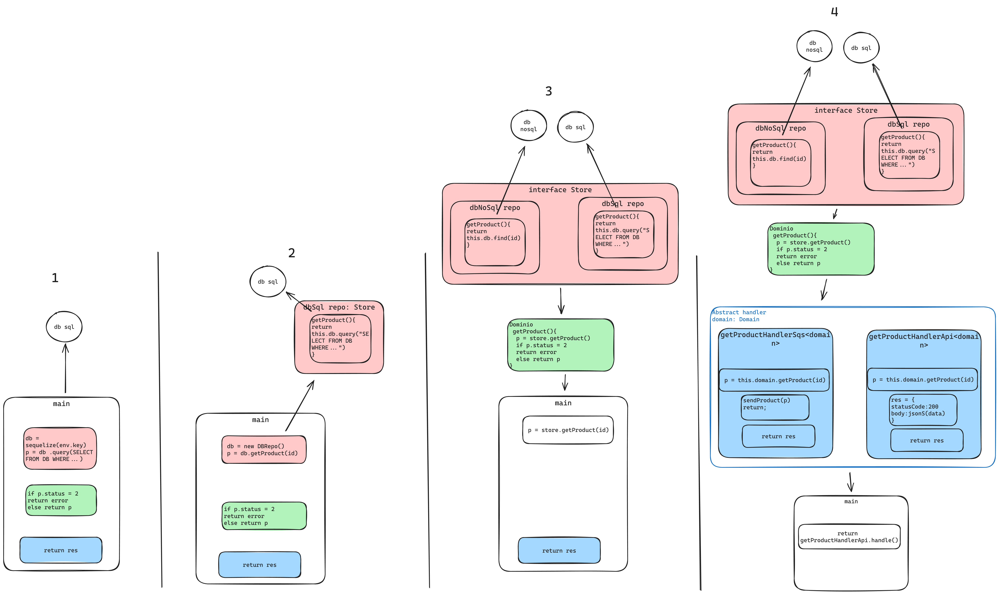

<div align="center">

# Inversão de Dependência na Prática

</div>

Nesse repositorio vamos implementar inversao de dependencia ou DI(dependency inversion) ná prática;

<p align="center">

</p>

<div align="center">

## [Veja o Video dessa implementação!](https://youtu.be/QjUPhLq94ng)

</div>

<!-- ## Sobre: -->

### Contexto:

Quando se trata de inversao de dependencia em programação, falamos de desacoplar as regras, ou seja, abstrair(extrair) as regras para uma camada superior onde se pode lidar com esta camada de forma mais limpa.

Aqui vamos implementar um padrão conhecido como Layered Arquitechture, onde separamos a camada de dados,dominio e apresentação na aplicação.

Para entender melhor vamos acompanhar a seguir:

### Implementação:

Essa implementação irá ocorrer em 4 passos, que pode ser observada pela [estrutura de arquivos](<https://tree.nathanfriend.io/?s=(%27options!(%27fancy!true~fullPatYtrailingSlasYrootDot!true)~w(%27w%271Unoss7x7iter5%2C%20jtud9_tar%C3%A1%20acoplado-VMII2Ux9paOKLZpersistenciaB%20%23iOfeit9coJuJpattern%20chamad9W6FcriamoCtambeJuJarquiv9par7XLtipoCd7aplic5II3UjvamoCKLaCregraCGnegocioE*BkdbNo0Fcriad9par7refor%C3%A7aL7possibilidaGGalter56II4Ue%20poLfiJKmoCZapr_ent5E-h8s%2FTApiHzCatendeJum7nec_sidaGXTQueueH8Mkhz%20deveJseL_tendid9d9h8%20baseBkdbNo06k%27)~version!%271%27)*%20%20-I*0SqlWM5a%C3%A7%C3%A3o6-VM-typ_M7a%208andler9o%20B-store%2Fkdb0Cs%20E-doV%2FkfooDoVMF*%23Gde%20I%5CnJm%20Kd_acoplaLr%20M.tsOss9%C3%A9%20TkgetProductU%2FFVmainWRepositoryX_pecificaYh!false~Z7camad7G_esjaqui%20k-*wsource!xprimeirz8MFoCh8%01zxwkj_ZYXWVUTOMLKJIGFECB987650-*>) a seguir

```sh
.
├── 1/  #nossa primeira iteração, aqui tudo estará acoplado
│   └── main.ts
├── 2/  #primeiro passo é desacoplar a camada de persistencia
│   ├── store/
│   │   └── dbSqlRepository.ts #isso é feito com um pattern chamado Repository
│   ├── main.ts
│   └── types.ts  #criamos tambem um arquivo para especificar tipos da aplicação
├── 3/  #aqui vamos desacoplar as regras de negocio
│   ├── domain/
│   │   └── fooDomain.ts
│   ├── store/
│   │   ├── dbSqlRepository.ts
│   │   └── dbNoSqlRepository.ts  #criado para reforçar a possibilidade de alteração
│   ├── main.ts
│   └── types.ts
└── 4/  #e por fim desacoplamos a camada de apresentação
    ├── domain/
    │   └── fooDomain.ts
    ├── handlers/
    │   ├── getProductApiHandler.ts  #os handlers atendem uma necessidade especifica
    │   ├── getProductQueueHandler.ts
    │   └── handler.ts  #os handler devem ser estendido do handler base
    ├── store/
    │   ├── dbSqlRepository.ts
    │   └── dbNoSqlRepository.ts
    ├── main.ts
    └── types.ts
```

em cada passo, como sugerido pelo nome das pastas, vamos abstrair(extrair) uma das camadas mencionadas.

### 1:

Em nossa primeira iteração temos a aplicação totalmente acoplada e nada reutilizavel, aqui se precisarmos de uma mesma funcionalidade em outro lugar, seria necessario copiar e colar o codigo 😱

### 2:

Normalmente a camada mais util de se extrair é a de persistencia, isso permite que toda uma aplicação tenha um acesso a informação de forma uniforme.

### 3:

Agora é abstraida a camada de domino, que se caracteriza pro regras de negocio, que regem a legalidade de alumas operações por exemplo.

### 4:

Aqui vamos uniformizar como disponibilizar nossa aplicação para o mundo exterior, por isso temos exe,plos de API e SQS, que sao casos de uso muito comuns.

---

Veja:



</br>

Ao final podemos ver que caso necessario podemos escalar a aplicação de forma horizontal, ou seja, basta adicionar um novo modulo em sua devida camada e utilizar.

Isso claro adicona complexidade na aplicação e requer mais configuração e planejamento, talvez nao seja necessario para algo muito pequeno. Mas é bom se prevenir não é mesmo?👼

Agora que ja sabe sobre DI, observe em aplicações que possua como voce poderia implementar algo similar, seguindo este principio!❤️

</br>


---

### Referencias:

- https://medium.com/@deanrubin/the-three-layered-architecture-fe30cb0e4a6
- https://medium.com/@pererikbergman/repository-design-pattern-e28c0f3e4a30
- https://medium.com/@tbaragao/solid-d-i-p-dependency-inversion-principle-e87527f8d0be
